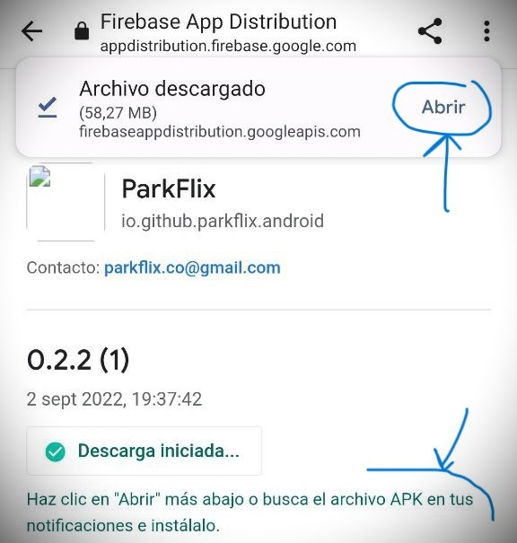
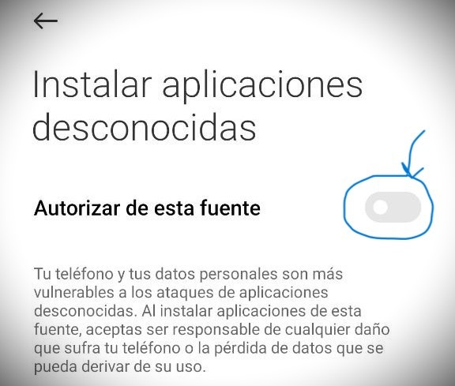
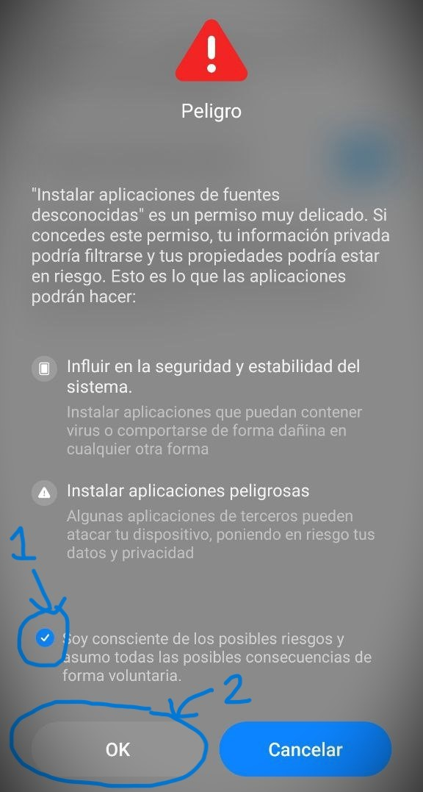

# ParkFlix para Android

Sigue los siguientes pasos para instalar la app de **ParkFlix** en tu móvil **Android**:

## Regístrate en Firebase App Distribution

Debes **registrarte** en **Firebase App Distribution** siguiendo el enlace que te proporcionamos (o escaneando el **código QR** con la cámara de tu móvil). Sólo tendrás que facilitarnos tu correo electrónico:

En unos días **te enviaremos un e-mail** con instrucciones para descargar e instalar la app de **ParkFlix** en tu móvil.

## Instalar ParkFlix en tu móvil

Si has recibido el **e-mail para descargar la app de ParkFlix**, y aún así tienes dudas, sigue los siguientes pasos:

> Como vamos a instalar la app de ParkFlix sin usar la **Play Store**, que es la vía oficial y segura de instalar aplicaciones en Android, el sistema nos mostrará una serie de avisos al respecto.

1. Pulsa el botón **Download the latest build** del e-mail:

	

2. Pulsa el botón **Descargar** para iniciar la descarga:

	

3. Confirma que quieres descargar la app:

	

4. Abrimos la app recién descargada para iniciar su instalación:

	

5. Pulsamos en **Ajustes** para permitir la instalación de la app desde Google Chrome:

	

6. Marcamos la casilla **Autorizar de esta fuente**:

	

7. Marcamos la casilla **Soy consciente de los posibles riesgos...** y pulsamos **Ok**:

	

8. Pulsamos el botón **Instalar**:

	

Y proceso completado, ya hemos instalado ParkFlix en nuestro dispositivo.
